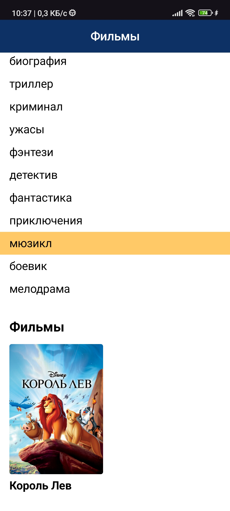
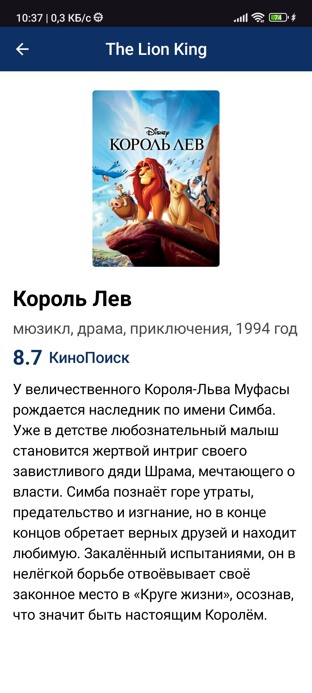

# Test Film 🎬

Простое клиент-серверное приложение для просмотра информации о фильмах с использованием современного стека Android-разработки.

## 🌟 Особенности
- Список фильмов с обложками и фильтрацией по жанрам
- Детальная информация о фильме (описание, рейтинг, год выпуска)
- Асинхронные запросы через Retrofit + Coroutines
- Современный UI на Jetpack Compose + Fragments
- Поддержка Material Design 3 
- Локализация через ресурсы strings.xml
- Чистая архитектура с применением паттерна MVVM

## 🛠 Технологии
| Компонент       | Технология                          |
|-----------------|-------------------------------------|
| Архитектура     | MVVM                               |
| DI              | Koin                               |
| Асинхронность   | Kotlin Coroutines                  |
| Сеть            | Retrofit 2 + Gson                  |
| Загрузка изображений | Glide (Compose integration)   |
| UI              | Jetpack Compose                    |
| Навигация       | Fragments                         |

## 📸 Скриншоты
| Список фильмов | Детали фильма |
|----------------|---------------|
|  |  |

## Цели

Этот проект выполнен в рамках тестового задания.
